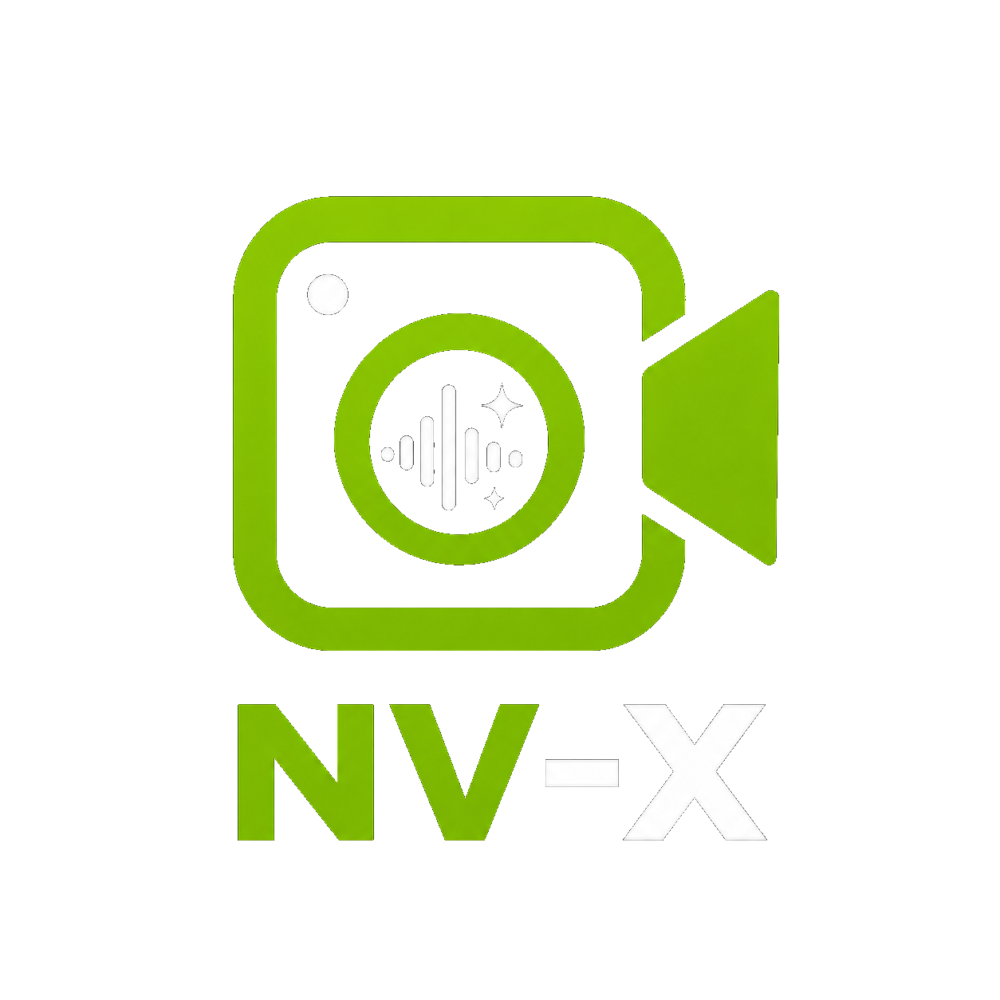

<p align="center">
  
</p>

# nv-x

> [!IMPORTANT]
> NV-X was built and tested around the author's specific Linux, NVIDIA GPU, camera, and audio setup. It is shared as a practical starting point rather than a universal solution—feel free to fork it, adapt it to your own hardware, and optimize or redesign any part of it under the project license.

> [!WARNING]
> NV-X depends on proprietary NVIDIA Maxine SDKs, models, and other resources obtained through NVIDIA NGC. Those NVIDIA materials are **not** covered by this repository's [MIT license](LICENSE) and are governed by the separate terms supplied by NVIDIA and NGC. `nv-x setup` downloads them for the local user but does not grant permission to redistribute them. Review and accept the applicable NVIDIA licenses before downloading, using, or distributing any NVIDIA component.

`nv-x` (NVIDIA Effects) is a native Linux video and audio effects service with a configuration-only desktop GUI.

## Features

- Linux-first background service and Wails configuration GUI, targeting CachyOS/Arch.
- `v4l2loopback` camera exposed as **NV-X Camera**.
- Background blur, replacement, chroma, and mask video effects.
- PipeWire microphone with dereverb/denoise or Studio Voice Low Latency.
- Demand-driven video and audio processing when applications consume the virtual devices.
- Optional processed self-hearing and Elgato light auto-control.
- GUI device selection, effect controls, and service/camera/microphone status.

## Dependencies

Required before running `nv-x setup`:

- Linux with systemd user services.
- `v4l2loopback-dkms` and matching kernel headers for the running kernel.
- Cam Link or another V4L2 input that can provide `NV12 1920x1080 @ 50fps`.
- NVIDIA GPU/driver stack compatible with NVIDIA Maxine.
- NVIDIA NGC CLI authenticated with `ngc config set`, or an API key exported as `NGC_API_KEY`/`NGC_CLI_API_KEY`.
- PipeWire, PipeWire Pulse compatibility, and WirePlumber.
- `pkexec`/polkit for GUI loopback write/reload elevation.
- `fuser` from `psmisc` is optional but useful for troubleshooting busy devices.
- Wails GUI runtime dependencies: GTK 3 and WebKitGTK 4.1.

You do **not** need to install the Maxine SDKs or models manually for normal use. `nv-x setup` provisions:

- Maxine Video Effects SDK Core under `/usr/local/VideoFX`.
- GreenScreen, BackgroundBlur, and their required VideoFX/TensorRT models.
- Maxine Audio Effects SDK 2.1 under `/usr/local/AudioFX`.
- The 48 kHz dereverb/denoiser and Studio Voice Low Latency audio models.
- The NV-X user config, v4l2loopback configuration, and systemd user service.

Build:

- Go 1.24 or newer.
- Wails v2 CLI.
- Bun.
- WebKitGTK/GTK development packages required by Wails. On this system the Wails build uses the `webkit2_41` tag, configured in `app/wails.json`.
- C/C++ build tools for the native Maxine helpers.
- Maxine SDK headers and libraries at the configured `MAXINE_SDK` and `AFX_SDK` paths when compiling the native helpers directly from source. This build-time requirement does not apply when installing an already-built NV-X package.
- `makepkg`/`pacman` for the CachyOS/Arch package install flow.

Arch/CachyOS package names are typically:

```bash
sudo pacman -S --needed go gcc make wails webkit2gtk-4.1 gtk3 v4l2loopback-dkms pipewire pipewire-pulse wireplumber psmisc polkit
```

Install the kernel headers that match `uname -r`; on CachyOS this may be a CachyOS-specific headers package rather than plain `linux-headers`.

`bun` may be installed either through pacman or your existing user install. The local package target runs `makepkg --nodeps`, so it can use `bun` from your current `PATH` instead of requiring the pacman `bun` package. For a strict redistributable PKGBUILD, install `bun` through pacman and remove `--nodeps`.

If `wails` is not available from pacman on the target machine, install the Wails v2 CLI with Go:

```bash
go install github.com/wailsapp/wails/v2/cmd/wails@latest
```

Set up the NVIDIA NGC CLI before first setup:

```bash
ngc config set
# Optional when the key is already stored by `ngc config set`:
export NGC_API_KEY=<your-ngc-api-key>
```

`nv-x setup` provisions both SDK families and their required models. Use `--skip-video` or `--skip-audio` only for troubleshooting.
It checks `NGC_API_KEY`, `NGC_CLI_API_KEY`, and `~/.ngc/config` in that order. If none contains a key, an interactive setup securely prompts for one without echoing it.

## Minimal Usage

Starting with an installed NV-X package, authenticate the NGC CLI and run setup as your normal desktop user:

```bash
ngc config set
nv-x setup
nv-x-gui
```

`nv-x setup` may ask for sudo when installing the SDKs and configuring v4l2loopback, but the command itself must not be run with `sudo`. It installs, enables, and starts `nv-x.service` for your user.

In the GUI, select the camera and microphone inputs, then enable one video effect and—optionally—one audio effect. In calling or recording applications, select **NV-X Camera** and/or **NV-X Microphone** as the input devices. The background service keeps the virtual devices available and starts the expensive processing paths only when they are needed; enabling self-hearing intentionally keeps audio processing active.

## Build And Install

Recommended CachyOS/Arch desktop install:

```bash
make check
make desktop
```

`make desktop` builds a local Arch package from `packaging/arch/PKGBUILD`, removes stale user-local GUI files that can shadow the package, installs the newest `nv-x-*.pkg.tar.zst` with `sudo pacman -U`, and refreshes desktop caches when the cache tools are available.

The package installs:

```text
/usr/bin/nv-x
/usr/bin/nv-x-gui
/usr/bin/nv-x-video
/usr/bin/nv-x-audio
/usr/lib/nv-x/nv-x-os-release-shim.so
/usr/share/applications/nv-x-gui.desktop
/usr/share/icons/hicolor/256x256/apps/nv-x-gui.png
/usr/share/licenses/nv-x/LICENSE
```

The GUI binary is intentionally named `nv-x-gui`; the CLI remains `nv-x`.

Manual package steps, equivalent to the package part of `make desktop`:

```bash
make package
sudo pacman -U packaging/arch/nv-x-*.pkg.tar.zst
```

Developer-local install is still available:

```bash
make install
```

`make install` installs into `~/.local/bin` and `~/.local/lib/nv-x`. It is useful for development, but the package path is preferred for a normal CachyOS/Arch desktop because Plasma/Gtk launchers resolve `/usr/bin` and `/usr/share/applications` more reliably than ad hoc user-local desktop entries.

```bash
nv-x setup
```

Run `nv-x setup` as your normal desktop user, not with `sudo`. Setup validates sudo once up front, then invokes `sudo` only for root-scoped SDK installation under `/usr/local`, the `/etc/modprobe.d/nv-x-v4l2loopback.conf` file, and the `v4l2loopback` reload. The service is a systemd user service and must be installed for your desktop account.

`nv-x setup` creates the user config if missing, provisions the VideoFX SDK and its GreenScreen/BackgroundBlur resources, provisions the Audio Effects SDK and the dereverb/denoiser and Studio Voice Low Latency models, writes and reloads the v4l2loopback config, installs/enables/starts the user service, and validates both runtimes with `fx doctor` and `audio doctor`.

Useful partial setup flags:

```bash
nv-x setup --dry-run
nv-x setup --skip-config
nv-x setup --skip-sdk
nv-x setup --skip-maxine
nv-x setup --skip-video
nv-x setup --skip-audio
nv-x setup --skip-loopback
nv-x setup --skip-reload
nv-x setup --skip-service
nv-x setup --no-enable
nv-x setup --no-start
nv-x setup --force
```

## Config

The user config is stored at `~/.config/nv-x/config.toml`. `nv-x config show` renders the effective configuration; a new installation starts with:

```toml
[camera]
input_device = "/dev/video0"
input_format = "nv12"
width = 1920
height = 1080
fps = 50

[output]
device = "/dev/video10"
video_nr = 10
label = "NV-X Camera"
output_format = "yuv420p"

[loopback]
config_path = "/etc/modprobe.d/nv-x-v4l2loopback.conf"
exclusive_caps = true
max_buffers = 8

[fx]
enabled = true
mode = "blur"
background_image = ""
chroma_color = "#00ff00"
sdk_path = "/usr/local/VideoFX"
model_dir = "/usr/local/VideoFX/lib/models"
enable_os_release_shim = true
blur_strength = 0.75

[audio]
mode = "off"
input_node = ""
monitor_enabled = false
monitor_output_node = ""
dereverb_denoiser_intensity = 0.90
sdk_path = "/usr/local/AudioFX"
output_node_name = "nv-x-microphone"
output_description = "NV-X Microphone"

[light]
enabled = false
address = ""
brightness = 20
temperature = 206
timeout_ms = 1500

[service]
name = "nv-x.service"
exec_path = "/usr/bin/nv-x"

[ui]
theme = "system"
```

`nv-x loopback write` renders:

```conf
options v4l2loopback devices=1 video_nr=10 card_label="NV-X Camera" exclusive_caps=1 max_buffers=8
```

## FX Modes

FX is enabled with `[fx].enabled = true`. The selected live output mode is `[fx].mode` or `--background blur|mask|replace|chroma` for CLI commands:

- `blur`: runs GreenScreen and BackgroundBlur.
- `replace`: runs GreenScreen, then composites the foreground over `[fx].background_image`.
- `chroma`: runs GreenScreen, then composites the foreground over `[fx].chroma_color`.
- `mask`: runs GreenScreen and outputs the grayscale segmentation mask as a debug view.

Still-image validation:

```bash
nv-x fx doctor
nv-x fx test-image --input ./input.jpg --blur-output ./blur.png --removed-output ./removed.png --mask ./mask.png
```

Live native stream:

```bash
nv-x fx stream --input /dev/video0 --output /dev/video10 --background blur
nv-x fx stream --input /dev/video0 --output /dev/video10 --background replace --background-image ~/Pictures/background.png
nv-x fx stream --input /dev/video0 --output /dev/video10 --background chroma --chroma-color '#00ff00'
```

Transfer-only diagnostic path:

```bash
nv-x fx transfer --input /dev/video0 --output /dev/video10 --width 1920 --height 1080 --fps 50
```

This sends NV12 through `NvCVImage_Transfer()` into a GPU BGR buffer and back to CPU BGR, then writes YU12 with the existing output converter. It does not run GreenScreen, BackgroundBlur, chroma, or replacement.

The normal service path runs the same native helper on demand. `nv-x run` watches `/dev/video10`; when an external app opens the virtual camera, it starts `nv-x-video native-stream`. When no consumer remains, it stops the helper.

On CachyOS/Arch, the Maxine SDK can reject the host OS during `NvVFX_Load()`. `nv-x` enables a narrow `LD_PRELOAD` shim by default for helper processes only; it redirects Maxine's `/etc/os-release` read to an Ubuntu-shaped temporary file and does not change the system file.

## Audio Effects

`[audio].mode` selects one mutually exclusive live audio effect:

- `off`: keeps the virtual microphone and AudioFX processing disabled.
- `dereverb_denoiser`: applies the combined 48 kHz dereverberation and background-noise removal model. `dereverb_denoiser_intensity` accepts `0.0-1.0` and defaults to `0.90`.
- `studio_voice_low_latency`: applies the real-time Studio Voice model. The dereverb/denoiser intensity setting does not apply to this mode.

When an effect is enabled, `nv-x-audio` registers the PipeWire source named by `output_node_name` (shown to applications using `output_description`). Leaving `input_node` empty follows the current PipeWire default microphone. The physical microphone and AudioFX model remain idle until an application actually reads from the virtual microphone.

Setting `monitor_enabled = true` enables processed self-hearing. `monitor_output_node` selects its PipeWire playback device; an empty value follows the system default output. Self-hearing intentionally keeps microphone capture and AudioFX processing active even when no application is reading the virtual microphone. Use headphones to avoid acoustic feedback.

Useful audio diagnostics:

```bash
nv-x audio list
nv-x audio doctor
pactl list short sources
```

## Processing Architecture

The video pipeline is Cam Link first by default:

```text
/dev/video0 Cam Link
  -> nv-x-video native-stream
       V4L2 input
       CPU NV12 -> BGR
       NVIDIA Maxine effects
       CPU BGR -> YU12
       V4L2 output
  -> /dev/video10 "NV-X Camera"
  -> Teams/Zoom/Discord/browser/etc.
```

Its default format is `/dev/video0` `NV12` `1920x1080 @ 50fps` into `/dev/video10` `YU12/yuv420p` at the same resolution and frame rate.

Audio runs independently in the same user service:

```text
PipeWire physical/default microphone
  -> nv-x-audio
       NVIDIA AFX dereverb + denoise, or Studio Voice Low Latency
       -> PipeWire source "NV-X Microphone"
          -> Teams/Zoom/Discord/browser/etc.
       -> optional processed self-hearing
          -> selected/default PipeWire output
```

## Light Auto-Control

`[light].enabled = true` lets the service turn an Elgato light on when an external app starts consuming `/dev/video10`, and turn it off when the stream returns to idle.

If `[light].address` is empty, `nv-x` tries to reuse the active IP from `~/.config/elgato-light-toggle/config.json`. If no light is configured or reachable, camera setup and streaming continue; the service logs the skipped light update and does not fail the stream.

`brightness` is `0-100`. `temperature` uses Elgato's API range, currently validated as `143-344`.

## Planned Features

- Animated backgrounds: support a preprocessed frame-folder asset format, such as `manifest.json` plus JPG/PNG frames, that loops during the live camera pipeline without requiring ffmpeg at runtime. Importing arbitrary video containers like WebM/MP4 may be added as an optional conversion step that can use ffmpeg when available, but the live camera service should remain native and ffmpeg-free.

## Manual Validation

```bash
v4l2-ctl -d /dev/video0 --list-formats-ext
nv-x loopback write --dry-run
nv-x setup --dry-run
nv-x audio doctor
nv-x run
```

Then open `/dev/video10` in a browser or video-call app and verify there are no purple/green artifacts.

To confirm the normal FX path is native and not using the old ffmpeg bridge:

```bash
pgrep -a ffmpeg
```

## Loopback Reload Troubleshooting

If unload fails because devices are busy, stop camera consumers first. Useful checks:

```bash
fuser -v /dev/video10
systemctl --user stop nv-x.service
```

Then reload:

```bash
sudo modprobe -r v4l2loopback
sudo modprobe v4l2loopback
```

Teams, Zoom, Discord, and browsers may cache camera names. Restart them after changing virtual camera labels.

## Desktop App

The Wails app lives in `app/`. It uses Svelte 5, Tailwind CSS 4, and shadcn-svelte.

```bash
make dev
```

`make dev` / `wails dev` starts the developer dashboard with detailed device, service, loopback, config, video-effect, and audio-effect diagnostics.

Production builds use the slim user UI:

```bash
make build
app/build/bin/nv-x-gui
```

The installed desktop app from `make desktop` is launched as `nv-x-gui`. The user UI has separate Video and Audio tabs for device/effect selection, dereverb/denoiser intensity, and processed self-hearing. Its Settings page controls theme and Elgato light auto-control. Changes are saved to the user config and restart the background service automatically after a short debounce.

## License

NV-X's original source code and project assets are available under the [MIT License](LICENSE). Dependencies and third-party materials remain under their own terms. NVIDIA Maxine SDKs, models, and NGC resources are not relicensed or redistributed by this repository; consult the license files supplied with each NVIDIA download before use or distribution.

> [!NOTE]
> NV-X is an independent open-source project and is not affiliated with, endorsed by, sponsored by, or supported by NVIDIA Corporation. NVIDIA, NVIDIA Maxine, NVIDIA NGC, and related names and marks are trademarks or registered trademarks of NVIDIA Corporation in the United States and other countries. All other trademarks belong to their respective owners.
